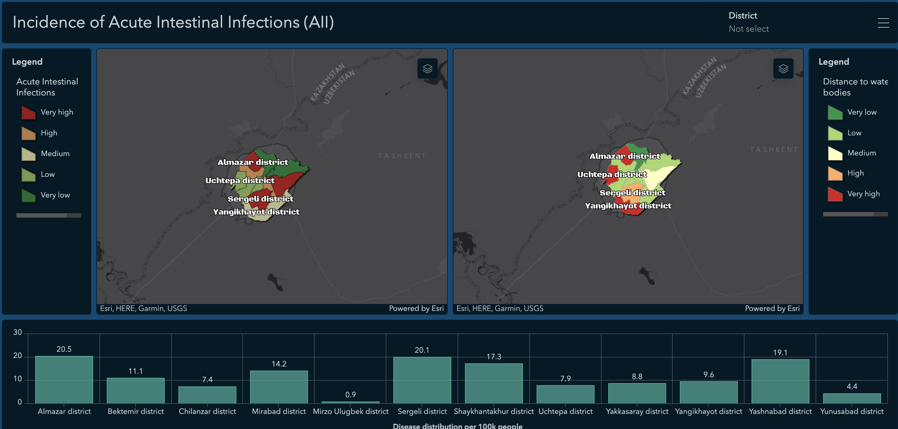

# UzCosmos-GIS-Hackathon
Specialise creating focal points in big data using open-source/gov/agencies combining with GIS after data analysis

follow the link to see the two focal points after analysis of data and answering the question spead of diseases in Tashkent  
https://rmituniversity.maps.arcgis.com/apps/dashboards/6395bc78a0ef4b5dadd20a388f058815

